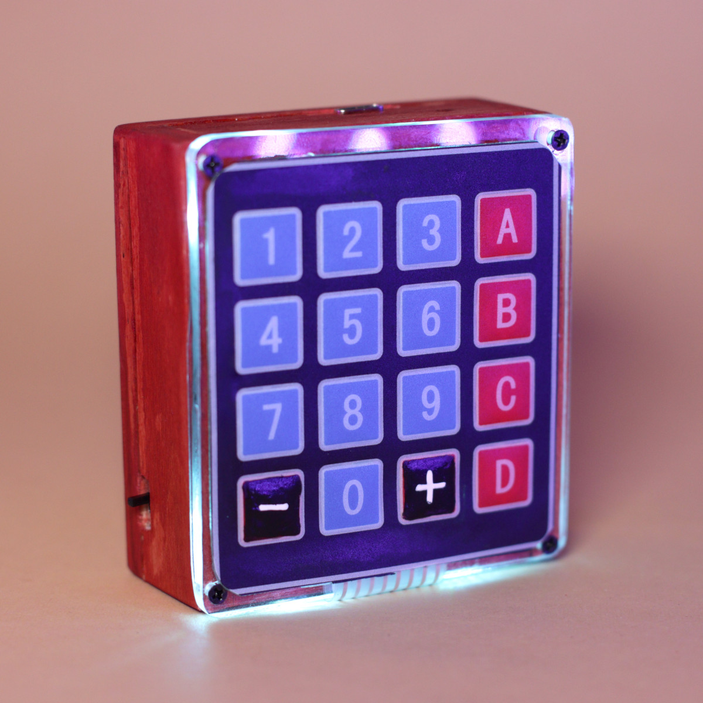

# VRRVRR

## LED-flashing, haptic metronome with presets and tap tempo. Written for Raspberry Pi Pico.

VRRVRR is a visual and haptic metronome, an aid for musicians.
Unlike traditional metronomes, it keeps the tempo by vibrating and blinking its LEDs.


See it in action: [YouTube video](https://youtu.be/H4etLLhSWDM)

### Usage

Press the digit keys to type the desired tempo.

When you're not typing, you can use the 0 key to tap the tempo instead.

Plus and minus keys increase and decrease the tempo.

Press letters A to D to load a preset. Hold one of the letter keys to store the current tempo to a preset.

Holding digits 1 to 9 sets different tempo measures. For example, by holding 3 I can subdivide the current beat into triplets.

Holding the 0 key toggles accents, so that the first subdivision of each beat is marked by a different LED color and a higher vibration frequency.


VRRVRR is powered by a lithium battery rechargeable via USB.

### Required libraries

The code uses two libraries I wrote. One is [RP2040-Battery-Check](https://github.com/TuriSc/RP2040-Battery-Check), used to turn on a little LED indicator when it's time to recharge the battery.

The other one is [RP2040-Keypad-Matrix](https://github.com/TuriSc/RP2040-Keypad-Matrix), which allows you to poll a keypad matrix like the one I used, detecting short and long key presses.

### Schematic and BOM


- Raspberry Pi Pico
- 4x4 keypad matrix. I removed its connector and soldered the exposed terminals to pin headers on the Pico
- 4x common-anode RGB LEDs (non-addressable). They come with their own resistors
- Lithium battery. Mine was 1100mAh, make sure it's between 1000mAh, and 2000mAh
- TP4056 battery charger module
- 2x SPST switches, latching
- 1000uF capacitor. Used to stabilize the current. A slightly different value can be used instead
- 3mm red LED to be used as a low-battery indicator
- 2x 1K resistors
- NPN transistor. I used a 2N2222 but BC547, S9014, BC108B, TMPSA13 or equivalent will work
- Vibrating motor. I salvaged mine from a broked smartwatch. It needs to work with 3.2V to 4.2V
- 1N4148 diode or equivalent
- An enclosure. I made mine from scratch using basswood and 3mm clear acrylic sheet

### Compiling

Required: make sure the [Pico SDK](https://github.com/raspberrypi/pico-sdk) is installed and accessible.

```shell
git clone https://github.com/TuriSc/VRRVRR
cd VRRVRR
git submodule init
mkdir build && cd build
cmake .. && make
```

After that, simply connect your Pico to your computer via USB holding the BOOTSEL button and copy the .uf2 file to flash the program.
If you've not changed the circuit and are happy with the default config.h parameters, you can flash the correct [precompiled .uf2 file](/dist) for your Pico version.

### More info

I've published more pictures and construction notes on my blog: [turiscandurra.com/circuits](https://turiscandurra.com/circuits)
